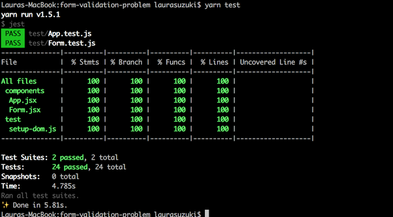

# Form Validation Problem from Springload

Hello! This is my solution to Springload's technical test.

---

## See my solution locally

Step 1:
```
git clone https://github.com/l-suzuki/form-validation-problem
cd form-validation-problem
```
Step 2:
```
npm install
- or -
yarn install
```
Step 3:
```
npm start
- or -
yarn start
```
Step 4:
Open your browser and navigate to http://localhost:8081 .
You should be able to view the App.

### Tests!

If you would like to see my test suite in action, run the following command in terminal:
```
npm test
- or -
yarn test
```
You should be able to see a fully passing coverage report, like this:



## The cherry on the cake

I have taken Documentation, Accessibility, Progressive enhancement, Browser support, Testing and Tooling into consideration as much as I was able, given the time-frame.

* I paid particular attention to writing test suites that would yield 100% coverage on my App. I achieved this using Jest and Enzyme.
* I have used git and Github to create appropriately named working branches as I went through the process.
* Commit messages are meaningful.
* I have created issues on github to alert others to potential bugs in the App that require attention.
* Ensured that obsolete or merged branches were deleted.
* Code has been commented where necessary for ease of understanding.
* I have provided instructions on how to setup and view the app in the ReadMe.
* I had a look through Springload's front end checklist to see what accessibility requirements were considered standard, and tried to implement these where possible.
* I have taken steps to make this App mobile friendly through the use of media queries and responsive css

## Reflections

I really enjoyed solving this problem! I think I kept the exercise within a reasonable time frame, however, to get my App up to the standard you see here I did overstep the recommended 2 hour time frame. This is partly due to the fact that I took on the challenge of migrating the vanilla HTML site to ReactJS, and the effort I put into writing tests.

If I had more time, I would dedicate it to fulfilling more of Springload's accessibility criteria, as I'd love to develop my skills in this area.
